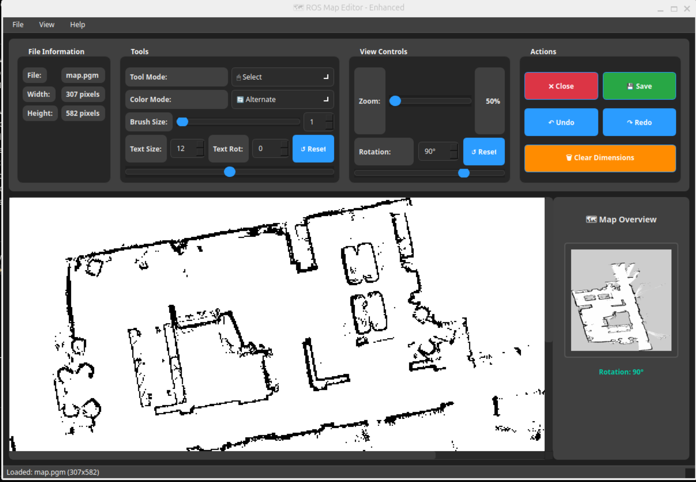

# ROS Map Studio

An interactive desktop tool to clean up 2D SLAM maps and annotate them with dimensions, lines, and text. Perfect for measuring distances in mapped areas and creating accurate floor plans from SLAM-generated 2D maps. **Features automatic dimension calculation and marking** - simply click two points and get real-world measurements instantly displayed with professional annotation styling. Built with PyQt5 and designed for fast editing, measurement, and export.

## Screenshots

### User Interface


### Cleaned Map with Dimensions


## Features

- Map loading from PGM with YAML metadata (resolution/origin/thresholds)
- Smooth progressive zoom (50%–400%) with live percentage indicator
- View rotation (-180° to 180°) with spinbox and Reset
- Tools:
	- 🖱️ **Select**: select/move text and items; rubber-band selection
	- 🖌️ **Paint**: brush-based editing using brush size; alternate single-click toggle
	- 📏 **Measure**: classic dimension with arrowheads and a yellow label box; select and delete
	- ➖ **Line**: two-click line drawing with preview; thickness tied to brush size
	- 🔤 **Text**: add/edit text, adjustable size and rotation with a Reset
- Undo/Redo via snapshot system (Ctrl+Z / Ctrl+Shift+Z)
- Clear Dimensions is undoable
- Headless safety: if no display is found on Linux, the app switches to offscreen platform to avoid Qt crashes (note: offscreen is non-interactive; use a desktop session to work)

## Requirements

- Python 3.8+ (earlier may work, but 3.8+ recommended)
- See `requirements.txt`:
	- PyQt5>=5.15
	- PyYAML>=6.0
	- Pillow>=9.0

Install dependencies:

```bash
pip install -r requirements.txt
```

## Project layout

```
ros-map-studio/
├─ requirements.txt
├─ README.md
├─ src/
│  ├─ MapEditor.py         # Main application
│  ├─ ui_map_editor.py     # Programmatic UI (used at runtime)
│  ├─ floor.pgm            # Example map
│  └─ floor.yaml           # Example map metadata
└─ maps/                   # Optional repo-level map directory (auto-resolved)
```

## Running

You can run the editor by pointing it to a map file name (with or without `.pgm`). The app tries paths in this order:

1) The argument exactly as given
2) The same path with `.pgm` appended
3) `maps/<name>` relative to the repo root
4) `maps/<name>.pgm` relative to the repo root

It then locates the corresponding YAML (`.yaml`) next to the image or under `maps/`.

Examples:

```bash
# From the repo root, open example map under src/
python3 src/MapEditor.py src/floor

# From src/, open example map in the same folder
cd src
python3 MapEditor.py floor

# Using a map under the repo-level maps/ directory
python3 src/MapEditor.py my_map           # if maps/my_map exists
python3 src/MapEditor.py my_map.pgm       # if maps/my_map.pgm exists
```

If you see “No DISPLAY found. Using offscreen platform,” you’re likely running in a headless terminal; start a desktop session to interact with the GUI.

## UI tour and controls

- View Controls
	- Zoom slider: 50%–400%; live percent label at the right
	- Rotation: slider + spinbox (-180..180) and Reset
- Tools
  - Tool Mode: 🖱️ Select, 🖌️ Paint, 📏 Measure, ➖ Line, 🔤 Text
  - 🖌️ Brush Size: slider + spinbox (for Paint tool)
  - ➖ Line Thickness: slider + spinbox (for Line tool)
  - 🔤 Text properties: size, rotation (-180..180), Reset
- Actions
	- Close, Save, Undo, Redo, Clear Dimensions
	- Status bar messages at bottom

## Tools in detail

- 🖱️ **Select**
	- Click items to select. Drag to rubber-band select. Press Delete/Backspace to remove selection.
- 🖌️ **Paint**
	- Brush paints cells using current color mode and brush size.
	- Color modes include Alternate (toggle per click), Occupied, Unoccupied, Uncertain.
- 📏 **Measure**
  - Click two points to add a measurement. Dimensions are automatically calculated and marked with a visual annotation.
  - **How it works**: The tool calculates the pixel distance between your two clicks, converts it to real-world units using the map's resolution value (meters per pixel) from the YAML metadata, and displays the result as a dimension line with arrowheads and a yellow label showing the distance in meters.
  - **Visual marking**: Each measurement appears as a black line with filled triangular arrowheads at both ends and a yellow background label box containing the precise distance measurement.
  - This tool is very useful for measuring distances in a mapped area and creating accurate floor plans from SLAM-generated maps.
  - This is particularly helpful for determining room dimensions, doorway widths, furniture placement areas, and other spatial measurements in architectural floor plans.
  - Click near a dimension line or on its label to select it. Press Delete to remove.
  - Clear Dimensions removes all dimensions (and is undoable).
- ➖ **Line**
  - Click to start, click again to end. Thickness is controlled by the dedicated Line Thickness control. ESC cancels in-progress drawing.
- 🔤 **Text**
	- Click to place a new text item, then edit inline (Enter to finish, ESC to cancel).
	- Use the Text Size and Text Rot controls; Reset sets rotation back to 0°.

## Keyboard shortcuts

- Esc: cancel measurement/line in progress, deselect dimension, or switch to 🖱️ Select
- V: switch to 🖱️ Select tool
- T: switch to 🔤 Text tool
- Delete/Backspace: delete selected dimension/items
- Ctrl+Z: Undo
- Ctrl+Shift+Z: Redo

## Saving outputs

Use the Save button to write two files into `output/` at the repo root:

- Raw map: `<name>.pgm` (the underlying model without annotations)
- Annotated: `<name>_annotated.png` (a render of the full scene including annotations)

The base name is derived from the currently opened map image.

## Development notes

- The app uses the programmatic UI in `src/ui_map_editor.py`; this is the source of truth.
- There is no active `.ui` Designer file in use. If you decide to adopt a `.ui` workflow in the future, reintroduce `uic.loadUi(...)` and maintain the `.ui` alongside the generated Python.
- Dimensions are stored and restored across redraws; lines and text annotations also persist and are undoable.

## Troubleshooting

- No DISPLAY / headless: On Linux without an X/Wayland display, the app switches to `QT_QPA_PLATFORM=offscreen` to avoid Qt crashes. This mode is not interactive—use a desktop session for editing.
- Map not found: The app prints all tried paths if it cannot open the map. Ensure your `.pgm` exists and that the corresponding `.yaml` includes keys: `resolution`, `origin`, `free_thresh`, `occupied_thresh`.
- YAML errors: If the YAML is missing or malformed, the app exits with an error message indicating the last parse error.

## License

No license file is provided. If you plan to publish or distribute, consider adding a license file (e.g., MIT, Apache-2.0).
